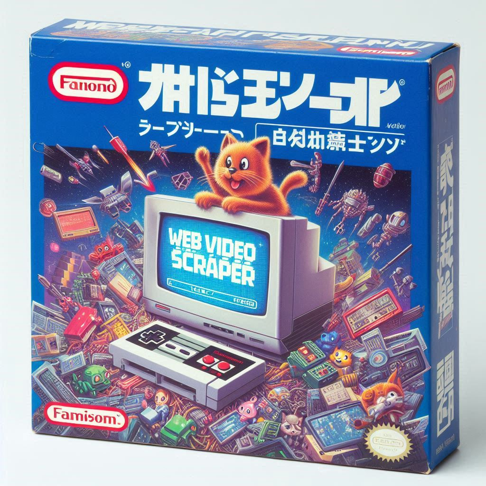

# NES Longplay Scraper

A web scraping tool designed to fetch download links for NES (Nintendo Entertainment System) longplay videos based on game titles. This tool currently supports pulling longplays for 443 out of 677 licensed NES games, with plans to add additional sources to further expand coverage.

### Technologies Used:

- **Puppeteer**: Headless Chrome Node.js API for web scraping.
- **Google Sheets API**: Integration with Google Sheets to store and manage game data.
- **Node.js**: JavaScript runtime environment for server-side logic.
- **Axios**: HTTP client for fetching data.
- **Cheerio**: jQuery-like library for parsing and manipulating HTML in Node.js.

### Features:

- Scrapes game titles and corresponding longplay video download links.
- Currently supports NES games, pulling longplay download links and wiki info for 443 games out of the total licensed NES library of 677 games.
- Supports dynamic page scraping via Puppeteer for interactive websites.
- Automatically stores scraped data in Google Sheets for easy reference and analysis.
- Data is cleaned and formatted before being added to the sheet (handling of special characters and whitespace).

### Future Improvements:

- **Database Support**: Transition from Google Sheets to a proper database for more scalable and robust data storage.
- **Extend Functionality**: Add support for additional sources of longplay videos.
- **Expand Platform Coverage**: Support more consoles beyond NES.
- **Search Optimization**: Enhance the search logic for more accurate title matching.
- **Batch Updates**: Implement bulk data handling to prevent timeout or API errors when processing large sets of data.
- **CLI Interface**: Develop a user-friendly command-line interface (CLI) for easier interactions.
- **Error Handling**: Improve robustness of data fetching and sheet updates.
